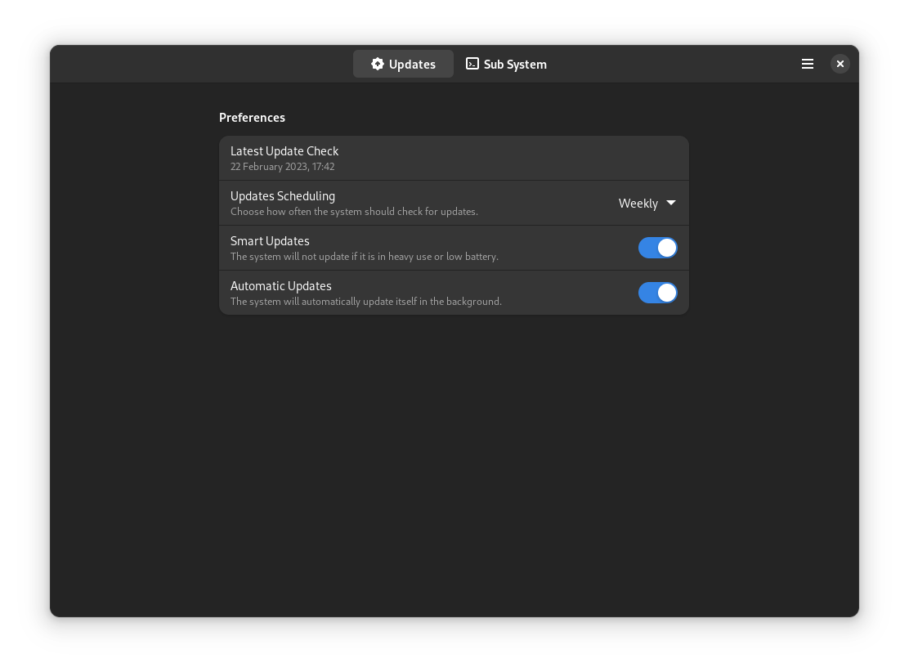

<div align="center">
    
    <h1>Vanilla OS Control Center</h1>
    <p>This utility is meant to be used in <a href="https://github.com/vanilla-os">Vanilla OS</a> 
    to manage its components (ABroot, VSO, Apx) and drivers via ubuntu-drivers-common.</p><br>
    <p><b>This project is deprecated, see <a href="https://vanillaos.org/2023/07/05/vanilla-os-orchid-devlog.html">this post</a> for more information.</b></p>
    <hr />
</a>
    <br />
    
</div>


## Build
### Dependencies
- build-essential
- meson
- libadwaita-1-dev
- gettext
- desktop-file-utils
- vte4

### Build
```bash
meson build
ninja -C build
```

### Install
```bash
sudo ninja -C build install
```

## Run
```bash
vanilla-control-center
```
